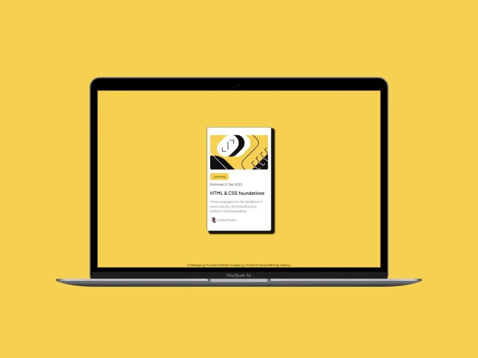

# Frontend Mentor - Blog preview card solution

This is a solution to the [Blog preview card challenge on Frontend Mentor](https://www.frontendmentor.io/challenges/blog-preview-card-ckPaj01IcS). Frontend Mentor challenges help you improve your coding skills by building realistic projects. 

## Table of contents

- [Overview](#overview)
  - [The challenge](#the-challenge)
  - [Screenshot](#screenshot)
  - [Links](#links)
- [My process](#my-process)
  - [Built with](#built-with)
- [Author](#author)

## Overview

### The challenge

Users should be able to:

- See hover and focus states for all interactive elements on the page

### Screenshot

### Links

- Solution URL: [FrontendMentor](https://www.frontendmentor.io/solutions/blog-preview-card-with-astro-and-tailwindcss-JprH1Hsw1a)
- Live Site URL: [vercel](https://frontend-mentor-blog-preview-card-sand.vercel.app/)

## My process

### Built with

- Semantic HTML5 markup
- CSS custom properties
- Flexbox
- [Astro](https://astro.build/)
- [TailwindCss](https://tailwindcss.com/) - CSS framework

## Author

- Github - [emanuel-ra](https://github.com/emanuel-ra/)
- Frontend Mentor - [@emanuel-ra](https://www.frontendmentor.io/profile/emanuel-ra)
- Linkedin - [@emanuelramirezabarca](https://www.linkedin.com/in/emanuelramirezabarca/)

## Run Locally  
Clone the project  

~~~bash  
  git clone git@github.com:emanuel-ra/Frontend-Mentor-Blog-preview-card.git
~~~

Go to the project directory  

~~~bash  
  cd app
~~~

Install dependencies  

~~~bash  
pnpm install
~~~

Start the server  

~~~bash  
pnpm run dev
~~~  
